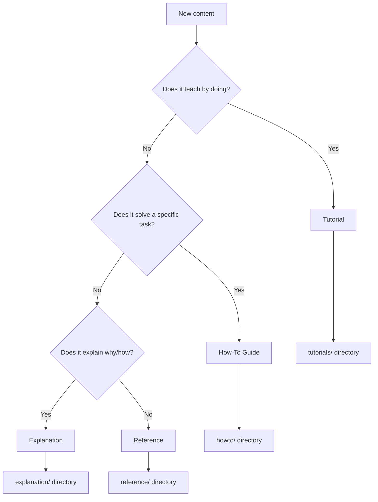
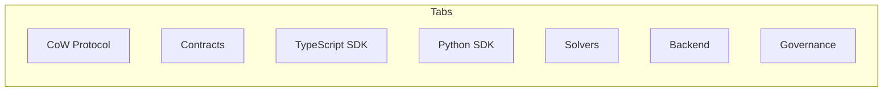

## Documentation Architecture

These docs serve multiple audiences across a complex protocol ecosystem. Here's how the entire documentation site is organized:

| Section | Contents |
|---|---|
| **CoW Protocol** | Overview, Explanation (How It Works, Benefits, Order Types, Flash Loans, CoW AMM, Architecture), CoW Swap (Trading Tutorials, Widget, Hook dApps), CoW Explorer, Integration (API, Quickstarts, Testing), Reference (APIs, Core, Auctions) |
| **Developer SDKs** | TypeScript SDK, Python SDK |
| **Contracts** | Core Contracts, Hooks Trampoline, ComposableCoW, Contracts SDK, Flash Loan Router |
| **Infrastructure** | BFF, Services, Watch Tower |
| **Governance** | Mission & Token, Grants, Fees |

## Framework: Diataxis

Every section follows the [Diataxis framework](https://diataxis.fr), which organizes content into four quadrants based on what readers need:

| | **Learning** | **Working** |
|---|---|---|
| **Practical** | **Tutorials** — Step-by-step lessons | **How-To Guides** — Task-oriented guides |
| **Theoretical** | **Explanation** — Concepts and context | **Reference** — Technical specifications |

### How to decide where content belongs



### Quick rules

- **Tutorials** teach. They have a learning outcome. "By the end, you'll have placed your first swap."
- **How-to guides** accomplish. They solve a task. "How to integrate the widget into your app."
- **Explanation** clarifies. It provides context. "Why CoW Protocol uses batch auctions."
- **Reference** describes. It's precise and complete. "The /quote endpoint accepts these parameters."

## Personas

The docs serve distinct audiences with tailored entry points:

| Persona | Entry Point | Primary Sections |
|---|---|---|
| **Trader** | [CoW Swap tutorials](/cow-protocol/tutorials/cow-swap/swap) | Order types, CoW Swap, CoW Explorer |
| **Integrator** | [Integration overview](/cow-protocol/explanation/integration-overview) | Widget, SDK, API, quickstarts |
| **Solver Operator** | [Test a solver locally](/cow-protocol/tutorials/solvers/local_test) | Solver tutorials, auction reference |
| **Smart Contract Dev** | [Contracts reference](/cow-protocol/reference/contracts/core) | ComposableCoW, Hooks, Flash Loans |
| **Backend Contributor** | [Services](/services/introduction) | BFF, Services, Watch Tower |
| **DAO Participant** | [Governance](/governance/explanation/mission) | Grants, fees, voting |

Each persona has a clear path from the [home page](/) — the "Find Your Path" table provides direct links.

## Sitemap

### Tab Structure



### CoW Protocol Tab (detailed)

```mermaid
graph TD
    CP[CoW Protocol] --> G1[Overview]
    CP --> G2[How It Works]
    CP --> G3[Benefits]
    CP --> G4[Order Types]
    CP --> G5[Flash Loans]
    CP --> G6[CoW AMM]
    CP --> G7[CoW Swap]
    CP --> G8[CoW Explorer]
    CP --> G9[Integration]
    CP --> G10[Architecture]
    CP --> G11[API Reference]
    CP --> G12[Core Reference]
    CP --> G13[Auctions]

    G2 --> F1[Flow of an Order]
    G2 --> F2[How Intents Are Formed]
    G2 --> F3[Quote Selection]
    G2 --> F4[Coincidence of Wants]
    G2 --> F5[Fee Model]

    G7 --> CS0[Protocol vs Swap]
    G7 --> CS1[Trading Tutorials]
    G7 --> CS2[Widget]
    G7 --> CS3[Hook dApps]
    G7 --> CS4[Custom Links]
    G7 --> CS5[Swap in Safe App]

    CS1 --> T1[Swap]
    CS1 --> T2[Limit Orders]
    CS1 --> T3[TWAP]
    CS1 --> T4[Native ETH]
    CS1 --> T5[Flash Loans]
    CS1 --> T6[Swap & Bridge]

    G8 --> CE1[Explorer Tutorials]

    G9 --> I1[API Integration]
    G9 --> I2[Testing]
    G9 --> QS[Quickstarts]

    QS --> Q1[cURL]
    QS --> Q2[Python]
    QS --> Q3[Token Approvals]

    G12 --> D1[Definitions]
    G12 --> D2[Signing Schemes]
    G12 --> D3[Error Reference]
    G12 --> D4[Rate Limits]
    G12 --> D5[Intents]
```



## Known Gaps

These are areas where the documentation is incomplete or could be significantly improved. Contributions are welcome — see [Content Guidelines](#content-guidelines) below for how to structure new pages.

### Missing guides and tutorials

| Gap | What's needed | Priority |
|---|---|---|
| **Flash loan SDK guide** | Programmatic flash loan order creation via SDK. The current [tutorial](/cow-protocol/tutorials/cow-swap/flash-loans) is UI-focused with a Sepolia walkthrough but lacks an SDK-first guide. | Low |
| **Batch order creation** | How to create and manage multiple orders in a single session — useful for market makers and automated strategies. | Low |

### Structural weaknesses

| Area | Issue |
|---|---|
| **Multi-chain specifics** | Docs are Ethereum-centric. Gnosis Chain, Arbitrum, and Base have different liquidity profiles, gas dynamics, and solver participation, but chain-specific guidance is sparse. |
| **Code freshness** | Static code snippets can go stale as the SDK evolves. The [interactive tutorials at learn.cow.fi](https://learn.cow.fi) mitigate this, but in-docs examples need periodic review against latest SDK versions. |
| **API reference depth** | The [Orderbook API reference](/cow-protocol/reference/apis/orderbook) links to the external [api.cow.fi/docs](https://api.cow.fi/docs) for full specs. Inline parameter documentation within the docs would reduce context-switching. |
| **Solver docs** | The solver tutorials cover creation and deployment, but advanced topics (custom routing strategies, gas optimization, competition dynamics) are thin. |

### How to help

If you'd like to contribute to any of these areas:

1. Check the [GitHub repository](https://github.com/cowprotocol) for the docs source
2. Follow the [Diataxis framework](#framework-diataxis) to decide where content belongs
3. Use existing guides as templates for style and structure
4. Ask in [Discord #tech-talk](https://discord.com/invite/cowprotocol) if you need protocol-level clarification

## Tech Stack

| Component | Tool |
|---|---|
| **Documentation platform** | [Mintlify](https://mintlify.com) (Sequoia theme) |
| **Content format** | MDX (Markdown + JSX components) |
| **Diagrams** | Mermaid (rendered by Mintlify) |
| **API docs** | OpenAPI specs (auto-rendered) |
| **Version control** | Git (GitHub) |
| **AI integration** | Mintlify native (Claude, ChatGPT, Perplexity, Cursor, MCP) |
| **Search** | Mintlify built-in search |

## Content Guidelines

### Writing style

- **Direct and concise** — lead with the answer, not the reasoning
- **Code-first** — show, don't tell. Every concept should have a code example
- **Multi-language** — TypeScript + Python + cURL where applicable
- **Practical** — every page should help someone do something

### Mintlify components we use

| Component | When to use |
|---|---|
| `<Steps>` / `<Step>` | Sequential procedures (quickstarts, tutorials) |
| `<CardGroup>` / `<Card>` | Navigation grids, feature showcases |
| `<Accordion>` | Expandable details, FAQ items |
| `<Note>` | Supplementary information |
| `<Warning>` | Common mistakes, breaking changes |
| `<Tabs>` / `<Tab>` | Language-specific code (TypeScript vs Python) |
| `<CodeGroup>` | Multiple code examples side by side |
| Mermaid code blocks | Architecture diagrams, flowcharts |

### File naming conventions

```
section/
├── explanation/          # Conceptual content ("why")
│   ├── topic-name.mdx
├── tutorials/            # Step-by-step lessons
│   ├── task-name.mdx
├── howto/                # Task-oriented guides
│   ├── task-name.mdx
└── reference/            # Technical specs
    ├── topic-name.mdx
```

### Navigation (docs.json)

All navigation is configured in `docs.json` at the project root. Each tab has groups, and groups contain pages. The structure:

```json
{
  "navigation": {
    "tabs": [
      {
        "tab": "Tab Name",
        "icon": "icon-name",
        "groups": [
          {
            "group": "Group Name",
            "icon": "icon-name",
            "pages": ["path/to/page"]
          }
        ]
      }
    ]
  }
}
```

## Keeping Docs Current

### When protocol changes land

1. **API changes** — Update the OpenAPI spec, then update any quickstarts or guides that reference affected endpoints
2. **New features** — Add explanation page (what/why), tutorial (how to use), and reference (specs)
3. **Contract deployments** — Update `snippets/core-contract-addresses.mdx` and any per-chain address tables

### Cross-references

The docs use extensive internal linking. When adding new pages:
- Link from relevant existing pages
- Add to the "Next Steps" section of related pages
- Update the home page if it's a major new section
- Add to the appropriate navigation group in `docs.json`

### Reusable snippets

Common content lives in `snippets/` and is imported via MDX:

| Snippet | Content |
|---|---|
| `community-links.mdx` | Discord, GitHub, Forum, Snapshot cards |
| `core-contract-addresses.mdx` | Settlement contract addresses per chain |
| `supported-networks.mdx` | Supported blockchain networks |
| `sdk-install.mdx` | SDK installation command |
| `settlement-contract.mdx` | Settlement contract reference |
