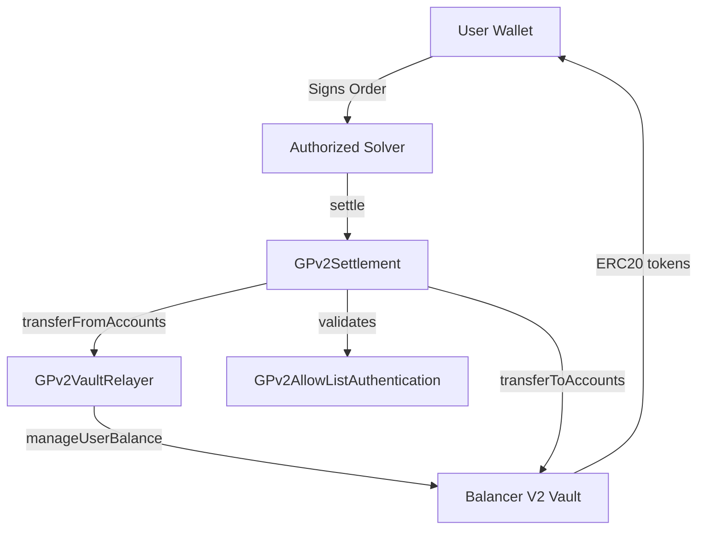

# Architecture

CoW Protocol's settlement system revolves around three interconnected contracts. The architecture leverages Balancer V2's Vault infrastructure while maintaining a permissioned solver network to execute batch auctions with MEV protection.

## Core Components

- **GPv2Settlement** - Central orchestration contract handling trade execution, order validation, and settlement logic
- **GPv2VaultRelayer** - Intermediary managing token transfers between users and the Balancer Vault
- **GPv2AllowListAuthentication** - Access control system governing the permissioned solver network

## Architecture Diagram

## Contract Relationships

### GPv2Settlement

Serves as the protocol's entry point with key responsibilities:

- **Order Validation** - Verifies signatures, expiry, and prices
- **Trade Execution** - Processes clearing prices and batched trades
- **Interaction Hooks** - Enables arbitrary pre/post-settlement calls
- **Reentrancy Protection** - Inherits from `ReentrancyGuard`

### GPv2VaultRelayer

Acts as a trusted intermediary. Only the creator (`GPv2Settlement`) can call this contract to manage token transfers.

### GPv2AllowListAuthentication

Implements solver permissions through an allowlist mapping. Only addresses added to the solver allowlist by the manager can call `settle()`.

## Token Flow

The token transfer process follows four stages:

1. **User Approval** - Users approve the Balancer Vault (not the settlement contract) to spend tokens
2. **Inbound Transfers** - Tokens are pulled from users into the settlement contract
3. **Interactions** - Optional arbitrary contract calls (e.g., DEX aggregators)
4. **Outbound Transfers** - Tokens are distributed to order receivers

## Security Features

| Feature | Description |
|---------|-------------|
| **Reentrancy Protection** | Settlement contract uses `nonReentrant` modifier on entry points |
| **Solver Authorization** | `onlySolver` modifier restricts execution to allowlisted addresses |
| **Interaction Restrictions** | VaultRelayer cannot be called as an interaction target |
| **Creator-Only Access** | VaultRelayer enforces sole settlement contract invocation |

## Design Principles

- **Separation of concerns** across specialized contracts
- **Minimal trust model** - users approve only the Balancer Vault
- **Gas efficiency** through batch settlement amortization
- **Extensibility** via interaction hooks
- **MEV protection** through uniform clearing prices
