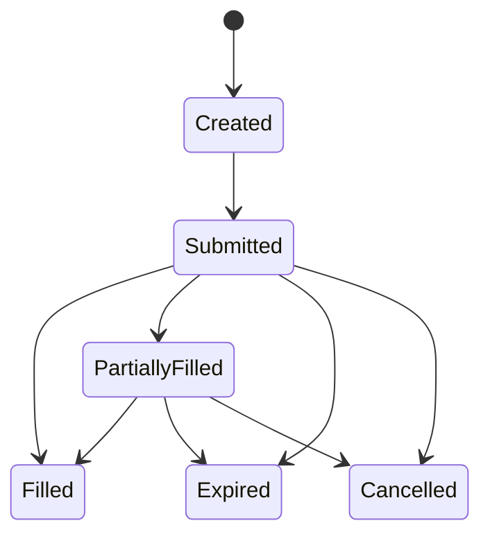

# Orders

CoW Protocol uses an intent-based order system where users express trading preferences off-chain, and solvers compete to find the best execution.

## Order Structure

Orders contain 12 parameters defining trading intent:

| Parameter | Type | Description |
|-----------|------|-------------|
| `sellToken` | `address` | Token to sell (ERC20) |
| `buyToken` | `address` | Token to buy (ERC20) |
| `sellAmount` | `uint256` | Amount of sell token |
| `buyAmount` | `uint256` | Minimum/maximum amount of buy token |
| `validTo` | `uint32` | Order expiration timestamp |
| `appData` | `bytes32` | Application-specific metadata |
| `feeAmount` | `uint256` | Fee amount in sell token |
| `kind` | `bytes32` | Order kind (sell or buy) |
| `partiallyFillable` | `bool` | Whether the order can be partially filled |
| `sellTokenBalance` | `bytes32` | Source of sell tokens |
| `buyTokenBalance` | `bytes32` | Destination of buy tokens |
| `receiver` | `address` | Recipient of bought tokens |

## Order Types

### Sell Orders
Specify an exact amount to sell with a minimum buy amount guaranteed:
- `sellAmount` is the exact amount of sell tokens to exchange
- `buyAmount` is the minimum acceptable amount of buy tokens

### Buy Orders
Specify an exact amount to buy with a maximum sell amount capped:
- `buyAmount` is the exact amount of buy tokens to receive
- `sellAmount` is the maximum amount of sell tokens to spend

## Order UID

Each order receives a unique 56-byte UID combining:
- **Order digest** (32 bytes) - EIP-712 hash of the order
- **Owner address** (20 bytes) - The order creator
- **Validity timestamp** (4 bytes) - Expiration time

## EIP-712 Signing

Orders use typed EIP-712 signatures enabling hardware wallet support. The protocol hashes order data with a domain separator to create an order digest.

```solidity
bytes32 orderDigest = keccak256(
    abi.encodePacked(
        "\x19\x01",
        domainSeparator,
        orderStructHash
    )
);
```

## Signature Schemes

CoW Protocol supports four signing methods:

| Scheme | Use Case |
|--------|----------|
| **EIP-712** | Standard typed data signing (recommended) |
| **eth_sign** | Legacy signing for compatibility |
| **EIP-1271** | Smart contract wallet validation (e.g., Gnosis Safe) |
| **PreSign** | On-chain pre-authorization |

## Balance Sources

Users can source tokens from three different balance types:

- **ERC20** - Standard ERC20 token balances
- **External** - Balancer Vault external balances
- **Internal** - Balancer Vault internal balances

## Order Validation

During settlement, five checks occur:

1. **Signature validity** - Verifies the order was signed by the owner
2. **Expiration status** - Ensures `validTo` has not passed
3. **Limit price compliance** - Checks that clearing prices respect order limits
4. **Fill amount verification** - Prevents overfilling
5. **Sufficient balance** - Confirms the user has enough tokens

## Order Lifecycle



- **Created** - Order signed off-chain
- **Submitted** - Order sent to the order pool
- **Filled** - Order completely executed
- **PartiallyFilled** - Order partially executed (if `partiallyFillable` is true)
- **Expired** - Order `validTo` timestamp has passed
- **Cancelled** - Order invalidated by the owner
