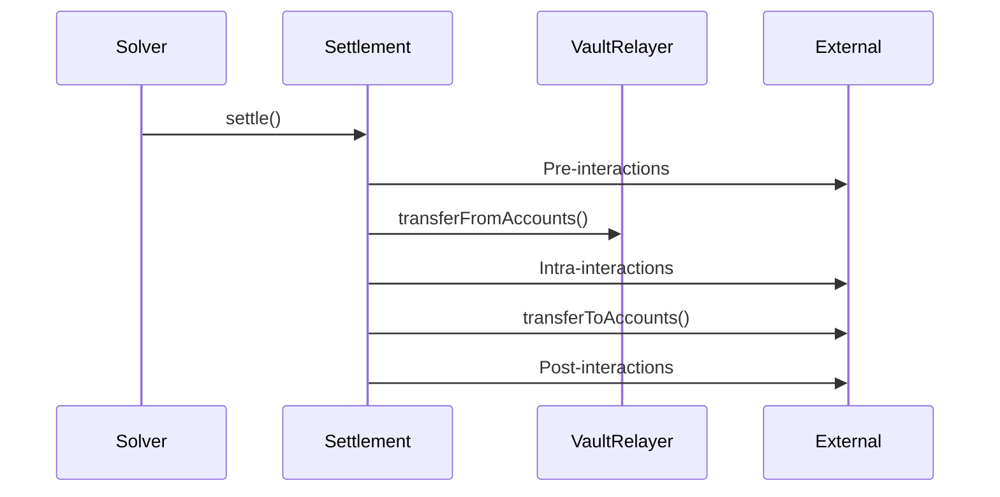

# Contracts Overview

CoW Protocol (Gnosis Protocol v2) is a decentralized trading protocol that leverages batch auctions and coincidence of wants to provide optimal trade execution.

## Core Contracts

### GPv2Settlement

The central orchestration contract handling order validation, batch settlements, and Balancer Vault coordination.

- Validates order signatures and parameters
- Executes batched trades at uniform clearing prices
- Manages pre/intra/post-settlement interactions
- Inherits from `GPv2Signing`, `ReentrancyGuard`, and `StorageAccessible`

### GPv2VaultRelayer

A relayer for Balancer Vault interactions and token transfers.

- Transfers tokens from user accounts to the settlement contract
- Executes batch swaps through Balancer pools
- Restricted to settlement contract access only

### GPv2AllowListAuthentication

Manages solver authorization via an allowlist mechanism.

- Maintains a mapping of authorized solver addresses
- Managed by a designated manager role
- Supports proxy-based upgradeability

## Key Libraries

| Library | Purpose |
|---------|---------|
| **GPv2Order** | EIP-712 order hashing and UID management |
| **GPv2Trade** | Trade encoding/decoding with compact flag representation |
| **GPv2Interaction** | Settlement interaction hooks for arbitrary contract calls |
| **GPv2Signing** | Multi-scheme signature verification (EIP-712, eth_sign, EIP-1271, PreSign) |

## Deployment Order

1. **Authentication contract** is deployed first (with proxy)
2. **Settlement contract** is deployed with the authenticator address
3. **VaultRelayer** is auto-deployed by the settlement contract constructor

## Three-Phase Settlement

## Security Features

- **Reentrancy protection** via `ReentrancyGuard`
- **Solver authorization** via `onlySolver` modifier
- **Order validation** including signature, expiry, and price checks
- **Interaction restrictions** preventing calls to VaultRelayer

## Gas Optimizations

- Assembly usage for low-level operations
- Storage refunds for expired order cleanup
- Compact trade encoding reducing calldata costs
- Memory reuse across settlement operations
