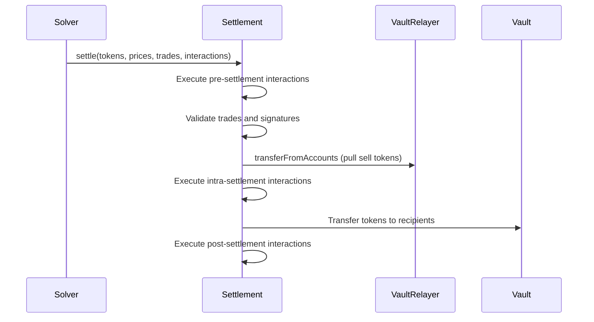

# GPv2Settlement Contract

The `GPv2Settlement` contract serves as CoW Protocol's core infrastructure, inheriting from `GPv2Signing`, `ReentrancyGuard`, and `StorageAccessible` to enable batch settlements and order validation.

**Source:** `src/contracts/GPv2Settlement.sol`
**License:** LGPL-3.0-or-later
**Solidity:** `>=0.7.6 <0.9.0`

## State Variables

### Immutable

| Variable | Type | Description |
|----------|------|-------------|
| `authenticator` | `GPv2Authentication` | Determines solver authorization |
| `vault` | `IVault` | Balancer Vault for fund management |
| `vaultRelayer` | `GPv2VaultRelayer` | Enables vault interactions on behalf of users |

### Storage

| Variable | Type | Description |
|----------|------|-------------|
| `filledAmount` | `mapping(bytes => uint256)` | Tracks per-order fill amounts to prevent over-filling |

## Primary Functions

### settle()

Executes batch orders at uniform clearing prices with pre/intra/post-settlement interactions.

```solidity
function settle(
    IERC20[] calldata tokens,
    uint256[] calldata clearingPrices,
    GPv2Trade.Data[] calldata trades,
    GPv2Interaction.Data[][3] calldata interactions
) external nonReentrant onlySolver;
```

### swap()

Matches orders directly against Balancer V2 pools for optimized single-pool trades.

```solidity
function swap(
    IVault.SingleSwap calldata swap,
    GPv2Trade.Data calldata trade
) external nonReentrant onlySolver returns (int256);
```

### invalidateOrder()

Allows order owners to revoke on-chain orders by invalidating the order UID.

```solidity
function invalidateOrder(bytes calldata orderUid) external;
```

### Storage Cleanup

Gas refund functions for expired orders:

```solidity
function freeFilledAmountStorage(bytes[] calldata orderUids) external;
function freePreSignatureStorage(bytes[] calldata orderUids) external;
```

## Settlement Execution Flow



## Security Protections

- All orders include a `validTo` timestamp checked on execution
- Filled amount tracking prevents over-filling
- Limit price validation ensures trades respect order parameters
- Solver authorization restricts settlement access via `onlySolver` modifier
- `nonReentrant` modifier prevents reentrancy attacks
