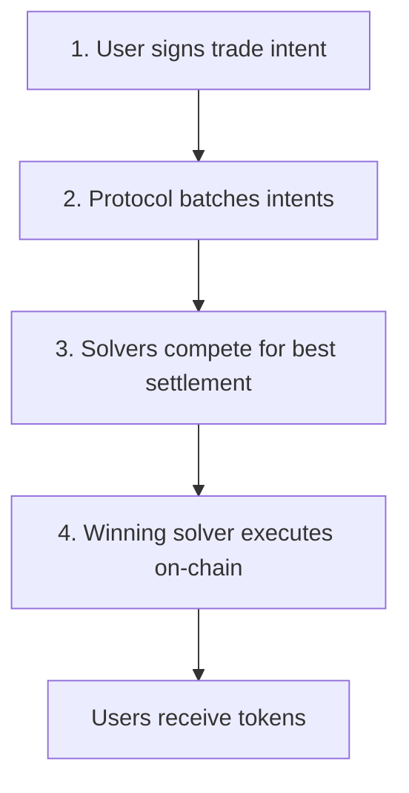

Let's bring all of our main concepts together by taking a look at the flow of an order through CoW Protocol.

There are 4 main steps to an order on CoW Protocol:

1. Users express their trade intents by signing messages that specify the assets and amounts they want to trade, alongside other parameters.
2. The protocol gathers the intents of multiple users into a [fair combinatorial batch auction](/cow-protocol/explanation/introduction/fair-combinatorial-auction).
3. Solvers have a set amount of time to propose settlements for the batch. The solver that is able to generate the highest amount of surplus for the batch is declared the winner.
4. The winning solver submits the batch transaction on-chain on behalf of the users.

Once the winning solver executes the batch's orders on-chain, users receive their tokens.

The competition between solvers in a batch auction ensures that users (including traders, DAOs, smart contracts, and bots) always receive the best prices for their trades.

Letting solvers do the heavy lifting means users don't have to worry about finding the best liquidity pool, setting the right gas price, or picking the optimal slippage tolerance for their trades. Solvers are also experts at avoiding MEV so users can rest assured their orders are protected from MEV bots that exploit their price through frontrunning and sandwich attacks.

