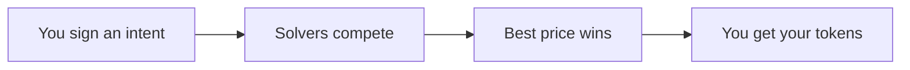

CoW Protocol is an intent-based trading protocol where users sign what they want to trade, and professional **solvers** compete to find the best execution path. Instead of trading directly against a single AMM, your order enters a **batch auction** where solvers optimize across all available liquidity sources.

## Why CoW Protocol?

<CardGroup cols={2}>
  <Card title="MEV Protection" icon="shield-check">
    Batch auctions with uniform clearing prices eliminate frontrunning and sandwich attacks.
  </Card>
  <Card title="Better Prices" icon="chart-line">
    Solvers access on-chain DEXs, private market makers, and peer-to-peer matching (Coincidence of Wants).
  </Card>
  <Card title="Gasless Trading" icon="gas-pump">
    No ETH needed for gas. Fees are taken from the sell token.
  </Card>
  <Card title="No Failed Transactions" icon="circle-check">
    You sign a message, not a transaction. If the order can't execute, you pay nothing.
  </Card>
</CardGroup>

## Key concepts

<Steps>
  <Step title="Intents">
    Users express **what** they want to trade, not **how**. You sign a message specifying tokens and amounts. [Learn more](/cow-protocol/explanation/introduction/intents)
  </Step>
  <Step title="Solvers">
    Professional third parties compete in an auction to fill your order at the best price. [Learn more](/cow-protocol/explanation/introduction/solvers)
  </Step>
  <Step title="Batch Auctions">
    Orders are grouped into batches and settled together, enabling peer-to-peer matching and uniform pricing. [Learn more](/cow-protocol/explanation/introduction/fair-combinatorial-auction)
  </Step>
</Steps>

## Start building

<CardGroup cols={3}>
  <Card title="Integrate via Widget" icon="window" href="/cow-protocol/howto/integrate/widget">
    Drop-in swap UI for your app
  </Card>
  <Card title="Use the SDK" icon="code" href="/cow-sdk/quickstart">
    Full TypeScript SDK for trading
  </Card>
  <Card title="Direct API" icon="square-terminal" href="/cow-protocol/howto/integrate/api">
    REST API for order management
  </Card>
</CardGroup>

## Explore the docs

| Section | What you'll find |
|---|---|
| **[How It Works](/cow-protocol/explanation/how-it-works/flow-of-an-order)** | Order flow, Coincidence of Wants, protocol vs swap |
| **[Benefits](/cow-protocol/explanation/benefits/mev-protection)** | MEV protection, price improvement, gasless trading |
| **[Order Types](/cow-protocol/explanation/order-types/market-orders)** | Market, limit, TWAP, programmatic, hooks, flash loans |
| **[Tutorials](/cow-protocol/tutorials/cow-swap/swap)** | Step-by-step guides for CoW Swap and Explorer |
| **[Architecture](/cow-protocol/explanation/architecture/overview)** | Orderbook, Autopilot, Driver, Solver Engine |
| **[API Reference](/cow-protocol/reference/apis/orderbook)** | Orderbook, Solver, and Driver APIs |
| **[Contracts](/cow-protocol/reference/contracts/core)** | Settlement, VaultRelayer, AllowList addresses |
