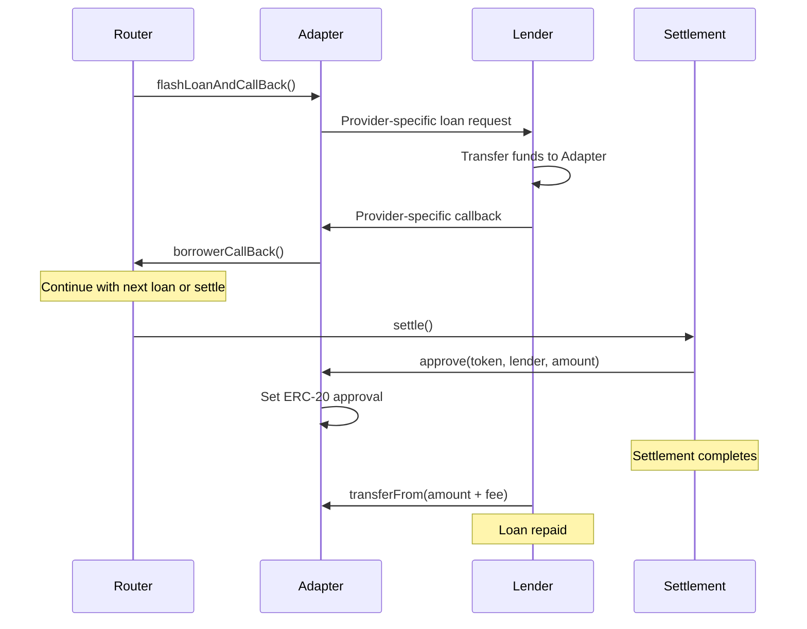

## Overview

Borrower adapters serve as intermediaries between the Flash-Loan Router and flash loan providers. Each adapter implements a standardized interface while handling provider-specific loan request and callback logic.

## Adapter Architecture

The adapter system uses an abstract base contract that provides common functionality:

```solidity
abstract contract Borrower is IBorrower {
    IFlashLoanRouter public immutable router;
    ICowSettlement public immutable settlementContract;

    constructor(IFlashLoanRouter _router) {
        router = _router;
        settlementContract = _router.settlementContract();
    }
}
```

### Key Components

- **Router Reference**: Immutable reference to the Flash-Loan Router that coordinates execution
- **Settlement Reference**: Direct reference to CoW Settlement contract for authorization
- **Standard Interface**: Common `IBorrower` interface for router interaction
- **Access Control**: Modifiers ensuring only authorized callers

## Core Functions

### Router Interaction

```solidity
function flashLoanAndCallBack(
    address lender,
    IERC20 token,
    uint256 amount,
    bytes calldata callBackData
) external onlyRouter {
    triggerFlashLoan(lender, token, amount, callBackData);
}
```

**Parameters:**
- `lender`: The flash loan provider contract address
- `token`: The ERC-20 token to borrow
- `amount`: The amount of tokens to request
- `callBackData`: Data to pass back to the router unchanged

### Fund Management

```solidity
function approve(
    IERC20 token,
    address target,
    uint256 amount
) external onlySettlementContract {
    token.forceApprove(target, amount);
}
```

<Note>
  Only the settlement contract can set approvals, preventing unauthorized access to borrowed funds.
</Note>

## Implementing an Adapter

To support a new flash loan provider:

1. Inherit the abstract `Borrower` contract
2. Implement `triggerFlashLoan` for provider-specific requests
3. Implement the provider's callback interface
4. Forward callbacks to `flashLoanCallBack`

### Required Implementation

```solidity
abstract contract Borrower {
    /// Implement this to request loans from the specific provider
    function triggerFlashLoan(
        address lender,
        IERC20 token,
        uint256 amount,
        bytes calldata callBackData
    ) internal virtual;

    /// Call this from the provider's callback function
    function flashLoanCallBack(bytes calldata callBackData) internal {
        router.borrowerCallBack(callBackData);
    }
}
```

## Example: Aave Adapter

```solidity
contract AaveBorrower is Borrower, IAaveFlashLoanReceiver {
    constructor(IFlashLoanRouter _router) Borrower(_router) {}

    function triggerFlashLoan(
        address lender,
        IERC20 token,
        uint256 amount,
        bytes calldata callBackData
    ) internal override {
        // Prepare Aave-specific parameters
        address[] memory assets = new address[](1);
        assets[0] = address(token);
        uint256[] memory amounts = new uint256[](1);
        amounts[0] = amount;
        uint256[] memory interestRateModes = new uint256[](1);
        interestRateModes[0] = 0; // No debt position

        // Request flash loan from Aave
        IAavePool(lender).flashLoan(
            address(this),
            assets,
            amounts,
            interestRateModes,
            address(this),
            callBackData,
            0 // referralCode
        );
    }

    function executeOperation(
        address[] calldata,
        uint256[] calldata,
        uint256[] calldata,
        address,
        bytes calldata callBackData
    ) external returns (bool) {
        flashLoanCallBack(callBackData);
        return true;
    }
}
```

**Key Points:**
- Inherit both `Borrower` and provider interface
- Implement `triggerFlashLoan` with provider-specific logic
- Implement provider's callback and forward to base

**Parameter Mapping:**
- `assets`: Single-element array with token address
- `amounts`: Single-element array with loan amount
- `interestRateModes`: Set to `[0]` to avoid opening debt positions
- `params`: Pass through `callBackData` unchanged
- `referralCode`: Set to `0` (currently inactive)

## Example: ERC-3156 Adapter

```solidity
contract ERC3156Borrower is Borrower, IERC3156FlashBorrower {
    bytes32 private constant ERC3156_ONFLASHLOAN_SUCCESS =
        keccak256("ERC3156FlashBorrower.onFlashLoan");

    constructor(IFlashLoanRouter _router) Borrower(_router) {}

    function triggerFlashLoan(
        address lender,
        IERC20 token,
        uint256 amount,
        bytes calldata callBackData
    ) internal override {
        bool success = IERC3156FlashLender(lender).flashLoan(
            this,
            address(token),
            amount,
            callBackData
        );
        require(success, "Flash loan was unsuccessful");
    }

    function onFlashLoan(
        address,
        address,
        uint256,
        uint256,
        bytes calldata callBackData
    ) external returns (bytes32) {
        flashLoanCallBack(callBackData);
        return ERC3156_ONFLASHLOAN_SUCCESS;
    }
}
```

**Key Points:**
- Simpler than Aave due to standardized interface
- Must return specific success constant

## Access Control

### Router-Only Access

```solidity
modifier onlyRouter() {
    require(msg.sender == address(router), "Not the router");
    _;
}
```

Only the registered router can trigger flash loans through the adapter.

### Settlement-Only Access

```solidity
modifier onlySettlementContract() {
    require(
        msg.sender == address(settlementContract),
        "Only callable in a settlement"
    );
    _;
}
```

Only the settlement contract can approve token transfers from the adapter.

**Security Assurances:**
- Only the router can initiate loans
- Only settlements can access borrowed funds
- External callers cannot disrupt execution flow

## Fund Flow



## Adding New Providers

Steps to follow:

1. **Research Provider API**: Understand the provider's flash loan request and callback mechanisms
2. **Create Adapter Contract**:
```solidity
contract NewProviderBorrower is Borrower, IProviderCallback {
    constructor(IFlashLoanRouter _router) Borrower(_router) {}
    // Implementation here
}
```
3. **Implement triggerFlashLoan**: Map standard parameters to provider-specific request format
4. **Implement Provider Callback**: Forward the provider's callback to `flashLoanCallBack(callBackData)`
5. **Deploy and Test**: Deploy the adapter and test with the router on testnets
6. **Update Documentation**: Document the new provider and its adapter address

## Best Practices

### Always Pass Data Unchanged

The `callBackData` parameter must be passed to the router exactly as received:

```solidity
// Correct
flashLoanCallBack(callBackData);

// Wrong - modifying data
flashLoanCallBack(abi.encode(parsed));
```

### Handle Provider-Specific Requirements

Each provider has unique requirements:
- Aave requires arrays and specific return values
- ERC-3156 requires returning a success constant
- Some providers may charge fees

### Validate Provider Responses

Check for success conditions specific to the provider:

```solidity
bool success = IERC3156FlashLender(lender).flashLoan(...);
require(success, "Flash loan was unsuccessful");
```

### Use Immutable References

Router and settlement references should be immutable for security:

```solidity
IFlashLoanRouter public immutable router;
ICowSettlement public immutable settlementContract;
```

## Next Steps

<CardGroup cols={2}>
  <Card title="Flash Loans" icon="bolt" href="/flash-loan-router/concepts/flash-loans">
    Learn about flash loan fundamentals
  </Card>

  <Card title="Security Model" icon="shield" href="/flash-loan-router/concepts/security-model">
    Understand security guarantees
  </Card>
</CardGroup>
