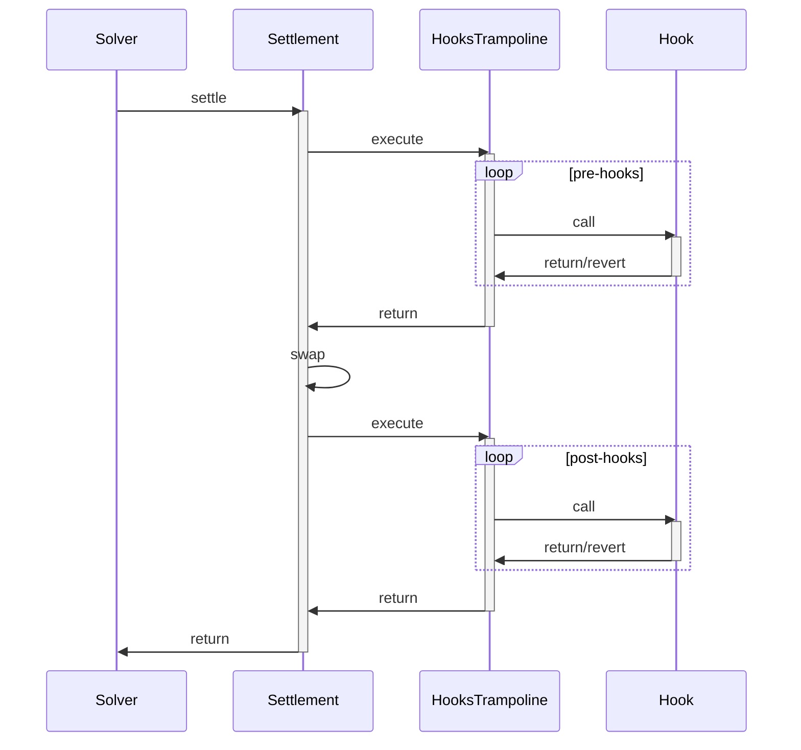

Hooks Trampoline is a critical security component in CoW Protocol that enables traders to execute custom Ethereum calls atomically within their settlement transactions—without compromising the protocol's security or stability.

Hooks allow traders to specify custom Ethereum calls as part of orders, executing atomically in the same transaction as trades. This enables use cases like conditional orders, automated portfolio rebalancing, and multi-step DeFi interactions. However, executing arbitrary user code within settlement transactions introduces risks. The Hooks Trampoline contract acts as a protective intermediary isolating user hooks from the privileged settlement contract context.

## The Problem: Why Trampoline is Needed

Two critical vulnerabilities exist without the Hooks Trampoline:

### 1. Privileged Context Exploitation

The settlement contract accumulates trading fees and holds funds. Without protection, malicious users could steal funds:

```solidity
// Without trampoline, this would steal accumulated fees
ERC20(token).transfer(attacker, settlementContract.balance)
```

### 2. Settlement Disruption

User hooks could disrupt settlements through:

- **Gas Griefing**: When settlement calls interactions, it forwards all remaining gas. If a hook reverts with an `INVALID` opcode, it consumes 63/64ths of total transaction gas, making settlements extremely expensive.

- **Cascading Failures**: If a hook reverts without being caught, all other orders in the settlement batch would fail, effectively DoS-ing legitimate traders.

## The Solution: Three-Layer Protection

### 1. Unprivileged Context

All hooks execute from the `HooksTrampoline` contract's context, never the settlement contract. This isolates hooks from accessing settlement contract's accumulated fees or privileged state.

```solidity
// From HooksTrampoline.sol:9-22
contract HooksTrampoline {
    /// The address of the CoW Protocol settlement contract
    address public immutable settlement;

    constructor(address settlement_) {
        settlement = settlement_;
    }

    modifier onlySettlement() {
        if (msg.sender != settlement) {
            revert NotASettlement();
        }
        _;
    }
}
```

When a hook executes, `msg.sender` is the `HooksTrampoline` address—never the settlement contract.

<Note>
Hook implementations can verify settlement execution by checking: `require(msg.sender == HOOKS_TRAMPOLINE_ADDRESS, "not a settlement");`
</Note>

### 2. Gas Limits

Each hook specifies a `gasLimit` capping maximum gas consumption, preventing `INVALID` opcodes or gas-intensive operations from consuming excessive gas.

```solidity
// From HooksTrampoline.sol:11-15
struct Hook {
    address target;
    bytes callData;
    uint256 gasLimit;  // Caps gas consumption per hook
}
```

The trampoline enforces this limit during execution:

```solidity
// From HooksTrampoline.sol:63-71
Hook calldata hook;
for (uint256 i; i < hooks.length; ++i) {
    hook = hooks[i];
    // Calculate gas available accounting for EVM's 63/64 rule
    uint256 forwardedGas = gasleft() * 63 / 64;
    if (forwardedGas < hook.gasLimit) {
        revertByWastingGas();
    }

    (bool success,) = hook.target.call{gas: hook.gasLimit}(hook.callData);
}
```

<Info>
The gas limit calculation accounts for the EVM's 63/64 forwarding rule. When a contract makes a call, it automatically reserves 1/64th of remaining gas for post-call operations.
</Info>

### 3. Revert Tolerance

The trampoline explicitly allows hooks to revert without affecting the settlement, preventing a single failed hook from disrupting an entire batch of orders.

```solidity
// From HooksTrampoline.sol:70-74
(bool success,) = hook.target.call{gas: hook.gasLimit}(hook.callData);

// In order to prevent custom hooks from DoS-ing settlements, we
// explicitly allow them to revert.
success;  // Intentionally ignored
```

The `success` value is read (avoiding compiler warnings) but deliberately ignored.

<Warning>
Hook developers should design hooks to handle failures gracefully. A reverting hook won't prevent trade execution but also won't achieve its intended effect. Consider implementing retry logic or fallback mechanisms.
</Warning>

## Settlement Flow



### Settlement Phases

**Pre-hooks**: Execute before the swap. Ideal for:
- Token approvals
- Position setup
- Conditional checks
- Pre-trade state modifications

**Swap**: The actual token exchange occurs in the settlement contract.

**Post-hooks**: Execute after the swap. Ideal for:
- Staking received tokens
- Claiming rewards
- Triggering follow-up actions
- State cleanup

<Note>
Both pre-hooks and post-hooks execute atomically within the same transaction. If settlement reverts for any reason (e.g., slippage protection), all hook effects are also reverted.
</Note>

## Edge Case: Gas Estimation

The trampoline includes a special mechanism for gas estimation edge cases with certain node implementations:

```solidity
// From HooksTrampoline.sol:79-90
/// @dev Burn all gas forwarded to the call. It's used to trigger an
/// out-of-gas error on revert, which some node implementations (notably
/// Nethermind) need to properly estimate the gas limit of a transaction
function revertByWastingGas() private pure {
    while (true) {}
}
```

When a hook lacks sufficient gas for execution, the trampoline deliberately wastes all remaining gas. This ensures Nethermind and similar nodes correctly estimate gas requirements through `eth_estimateGas`, preventing failures for transactions consuming less gas when reverting than when succeeding.

<Info>
This mechanism activates when `forwardedGas < hook.gasLimit`, ensuring solvers and users receive accurate gas estimates when hooks cannot execute due to insufficient gas.
</Info>

## Security Guarantees

The Hooks Trampoline provides the following security guarantees:

1. **Privilege Isolation**: Hooks never execute with settlement contract privileges
2. **Gas Protection**: No single hook can consume unlimited gas
3. **Fault Isolation**: Hook failures cannot disrupt settlements or affect other orders
4. **Settlement Verification**: Hooks can cryptographically verify execution within legitimate settlements
5. **Deterministic Execution**: Hook execution order and gas limits are explicitly specified and enforced

These protections make incorporating arbitrary user-defined logic into CoW Protocol settlements safe while maintaining security and reliability traders depend on.
